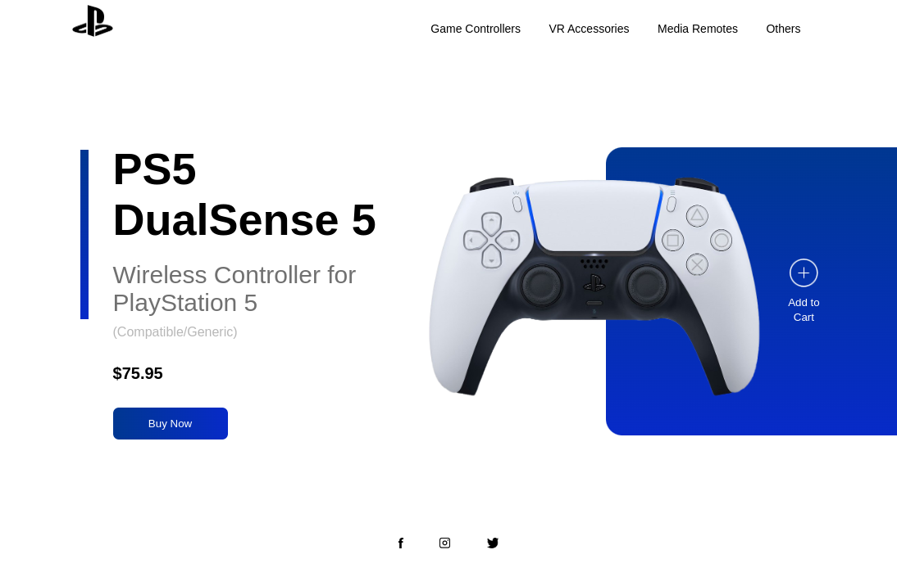

# Mock Responsive PlayStation Website | Pure HTML, CSS, JS

## Table of contents

- [Overview](#overview)
  - [The challenge](#the-challenge)
  - [Screenshot](#screenshot)
  - [Links](#links)
- [My process](#my-process)
  - [Built with](#built-with)
  - [What I learned](#what-i-learned)
  - [Continued development](#continued-development)
  - [Useful resources](#useful-resources)
- [Author](#author)

## Overview
Did some frontend mentor challenges before this and wanted to do something better on my own in a way. Built this using a YouTube video as a guide.
### The challenge

Users should be able to:

- See hover states for interactive elements

### Screenshot

### Links

- Live Site URL: [GitHub Pages](https://aadirajuthup.github.io/ps5/)

### Built with

- HTML5 markup
- CSS Design using divs and floats
- JavaScript

### What I learned

I learned more than I could with any YouTube tutorial and other resources ever could. Building real projects is the key is so true

### Useful resources

- [W3Schools](https://w3schools.com) - I did almost all the excercises they had which really helped me in understanding everthing about HTML and CSS in a much deeper level.
- [FreeCodeCamp](https://freecodecamp.org) - I also did a lot of practice at FreeCodeCamp. Every single student has to check out FreeCodeCamp there is probably no other better resource in the internet than FreeCodeCamp.(for free of cource)
- [CodeWithHarry Youtube Channel](https://www.youtube.com/channel/UCeVMnSShP_Iviwkknt83cww) - This whole channel is in Hindi. There is a playlist containing HTML & CSS. He only brushes over the basics you are going to need and I found that useful in identifying what I should focus on first and getting that inital boost to get started as fast as possible.

## Author

- Website (down) - [Atomsoft](https://atomsoft.in)
- Frontend Mentor - [@aadirajuthup](https://www.frontendmentor.io/profile/aadirajuthup)
